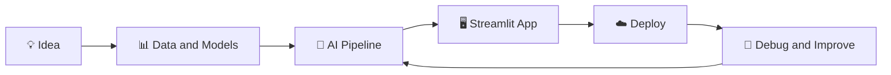
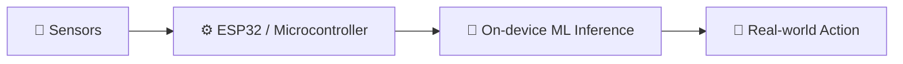

<!-- ═══════════════ HEADER BANNER ═══════════════ -->
<div align="center">


<a href="https://github.com/aniketkharose">
  
</a>

<br/>


</div>

---

## 👋 Hey, I'm Aniket

Final-year **E&TC Engineering** student at **SKNCOE, Pune** (Savitribai Phule Pune University). I like building AI that you can actually *use*: apps that see faces, hear voices, watch your squat form and score your resume, all deployed and running live.

My sweet spot is where **machine learning meets hardware**: computer vision on one side, microcontrollers and embedded systems on the other.

```python
class Aniket:
    role     = "AI/ML + Embedded Systems Engineer (in the making)"
    college  = "SKNCOE, Pune"
    focus    = ["Computer Vision", "Edge AI", "Embedded Systems", "NLP"]
    loves    = ["shipping real projects", "turning ideas into live demos"]
    looking  = "AI/ML and Embedded Systems internships"
```

---

## 🚀 Featured Projects

<table>
<tr>
<td width="33%" valign="top">

### 🧠 AI Resume ATS
*Know your score before the recruiter does.*

Analyzes a resume against a job description and returns an **ATS score, skill matching, feedback and recommendations**, with a downloadable PDF report.

`FastAPI` `Streamlit` `spaCy` `scikit-learn` `Supabase`

[🚀 Live Demo](https://ai-resume-ats-system-aniket.streamlit.app) · [💻 Code](https://github.com/aniketkharose/AI-Resume-ATS-System)

</td>
<td width="33%" valign="top">

### 📸 SnapClass
*Say cheese. You're marked present.*

AI attendance system using **face recognition** and **voice recognition**, with separate student and teacher portals.

`Dlib` `SVM` `Resemblyzer` `Streamlit` `Supabase`

[🚀 Live Demo](https://sanpclass-aniketkharose.streamlit.app/) · [💻 Code](https://github.com/aniketkharose/intelligent-ai-attendance)

</td>
<td width="33%" valign="top">

### 🏋️ AI Gym Coach
*A coach that watches every rep.*

Real-time **pose detection** with **form feedback** and **AI voice coaching** for workout tracking.

`MediaPipe` `OpenCV` `Streamlit` `Python`

[💻 Code](https://github.com/aniketkharose/ai-gym-coach-vision)

</td>
</tr>
</table>

### 🔬 What each project taught me

| Project | The interesting challenge |
|---|---|
| 🧠 **AI Resume ATS** | Deployed on a 512 MB free tier. Replaced a heavy transformer with a lightweight TF-IDF matcher to stop out-of-memory crashes. |
| 📸 **SnapClass** | Combined two biometric pipelines: Dlib embeddings with an SVM for faces, and Resemblyzer embeddings for voices. |
| 🏋️ **AI Gym Coach** | Turned live pose landmarks into real-time form feedback and spoken coaching. |

---

## 🧭 The Pipeline I Keep Building



## 🔮 Where I'm Heading: Edge AI



Right now I'm exploring how to run **ML models directly on ESP32 and microcontrollers**, bringing together my E&TC background and my AI work.

---

## 🛠️ Tech Stack

**Languages and Core**

<p>
  
  
  
</p>

**ML, DL and Vision**

<p>
  
  
  
</p>

**Backend, Apps and Data**

<p>
  
  
</p>

**Embedded and Hardware**

<p>
  
  
  
</p>

**Tools**

<p>
  
  
</p>

---

## 💬 Ask Me About

- 👁️ Computer vision, face and pose detection
- 🧠 Building and deploying ML pipelines end to end
- 🔌 Embedded systems and Edge AI on ESP32
- ☁️ Getting apps to run inside free-tier limits

---

## 📊 GitHub Stats

<div align="center">


</div>

---

## 📫 Let's Connect

I'm actively looking for **AI/ML and Embedded Systems internships**. If you're building something in computer vision, Edge AI or embedded AI, I'd love to chat.

<div align="center">

[](https://www.linkedin.com/in/aniket-kharose-3287242a5)
[](mailto:aniketk8010@gmail.com)
[](https://github.com/aniketkharose)

<br/>

*⭐ If you like my projects, a star goes a long way!*


</div>
